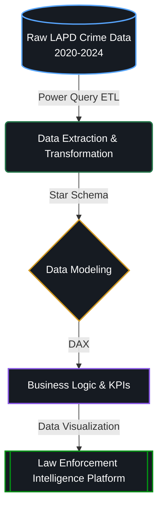

# Los Angeles Crime Analytics Dashboard

> A production-grade analytics platform transforming 5+ years of LAPD crime data into actionable intelligence for law enforcement operations and public safety decision-making.

---

## 🎯 Business Context

Law enforcement agencies generate massive volumes of incident data, yet often lack real-time visibility into crime trends, geographic hotspots, and clearance rates. Operational commanders need fast access to intelligence that informs patrol deployment, investigative resource allocation, and public safety strategy — but rely on static reports and fragmented spreadsheets.

**This project demonstrates a production-grade analytics solution** that bridges raw LAPD data and actionable law enforcement intelligence.

---
## 🖼 Dashboard preview 

---

### Key Stakeholders & Questions

| Stakeholder | Operational Question | Critical Metric |
|---|---|---|
| **Police Commander** | Where should we deploy patrol resources? | Crime hotspots, incident density by division |
| **Investigations Bureau** | Which cases remain open and need follow-up? | Open investigation count, clearance rate by crime type |
| **Crime Analysis Unit** | What crime patterns are emerging this month? | Crime trend YoY, seasonal patterns, weekly distribution |
| **Public Safety Leadership** | Are we reducing crime in target areas? | Total crime volume, crime category breakdown, arrest rate |
| **Community Relations** | Which areas have the highest crime impact? | Incidents by reporting area, crime severity distribution |

---

## 📊 Project Overview

This end-to-end analytics project transforms **5+ years of crime data (2020–2024)** from the Los Angeles Open Data Portal into a **data-driven intelligence platform** that supports law enforcement decision-making.

### Analytical Workflow

## 🏗️ Technical Architecture & Data Pipeline

### 🧩 Pipeline Breakdown

> #### 🗄️ **1. Raw LAPD Crime Data (2020-2024)**
> * **Volume:** 800K+ incident records.
> * **Complexity:** 130+ distinct crime categories.
> * **Attributes:** Geographic mapping (latitude/longitude, divisions), temporal timestamps, and operational status data (cleared arrests vs. open cases).

> #### ⚡ **2. Power Query (Extraction & Transformation)**
> * **Date Parsing:** Extracted discrete year, month, and day-of-week components for time-series analysis.
> * **Categorization:** Systematically grouped crime severity (Felony vs. Misdemeanor).
> * **Data Cleansing:** Standardized location geometries, derived explicit status indicators (Cleared/Open/Pending), and handled missing values/quality anomalies.

> #### 📐 **3. Data Modeling (Star Schema)**
> * **Fact Table:** Core LAPD crime incidents.
> * **Dimension Tables:** Time, Location, Crime Type, Status.
> * **Optimization:** Enforced strict one-to-many relationships and built aggregated summary tables for instant visual rendering and high-performance cross-filtering.

> #### 🧮 **4. DAX Measures (Business Logic)**
> * **Volume & Trends:** `Total Crimes`, `YoY Growth %`, and `Month-over-Month Change`.
> * **Performance Metrics:** `Clearance Rate` (Total Arrests ÷ Total Incidents).
> * **Operational KPIs:** `Crime Density` (incidents per geographic area) and `Open Cases` tracking.

> #### 📊 **5. Law Enforcement Intelligence Platform (Dashboards)**
> * **Geographic Analysis:** Interactive division-level heatmaps.
> * **Temporal Trends:** Granular time-series tracking by year and month.
> * **Performance Tracking:** Clearance rate benchmarks filtered by division and specific crime types.
> * **Interactivity:** Real-time open investigation tracker with global cross-filtering for ad-hoc detective workflows.
>
> 

---

## 📈 The Analyst's ROI (Return on Investment)

**The Operational Question:** *"Where should we deploy more patrol officers?"*

| ❌ Legacy Process (Manual) | ✅ New Analytics Platform (Automated) |
| :--- | :--- |
| • Manual review of incident reports (`4 hours`) | • Open Power BI dashboard (`5 seconds`) |
| • Count incidents by area in spreadsheet (`1 hour`) | • Filter by crime category & date range (`10 seconds`) |
| • Create static pivot table report (`1 hour`) | • Drill-down to specific areas/offenses (`30 seconds`) |
| **TOTAL: 6 Hours (Static Output)** | **TOTAL: < 1 Minute (Interactive & Ad-Hoc)** |

> ** Business Impact: 360x faster analysis.** Precinct commanders can now iterate on deployment strategies in real-time rather than waiting days for administrative reports.

